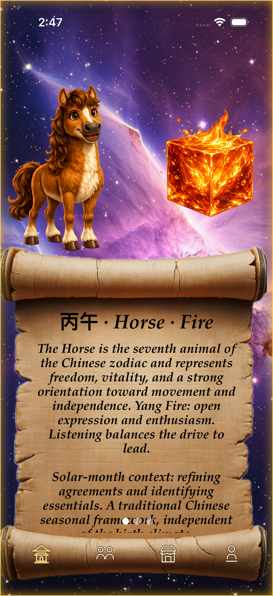
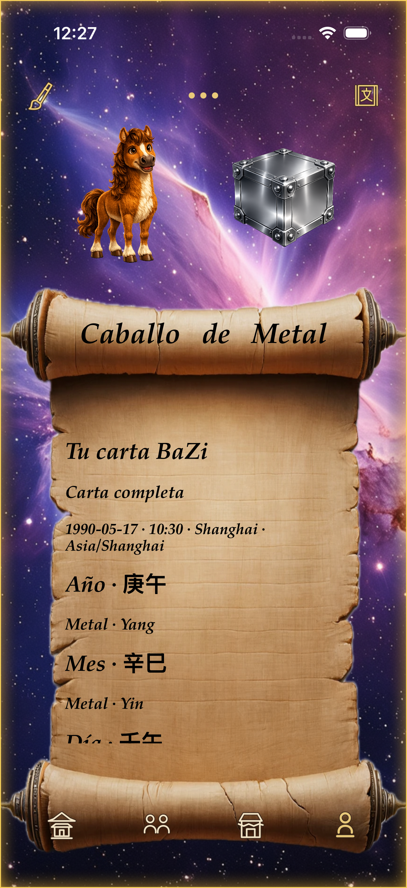
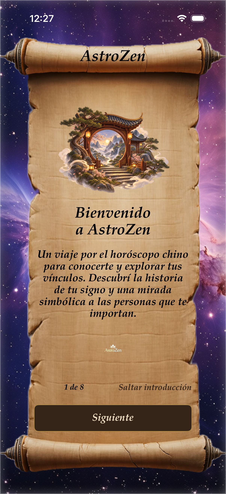
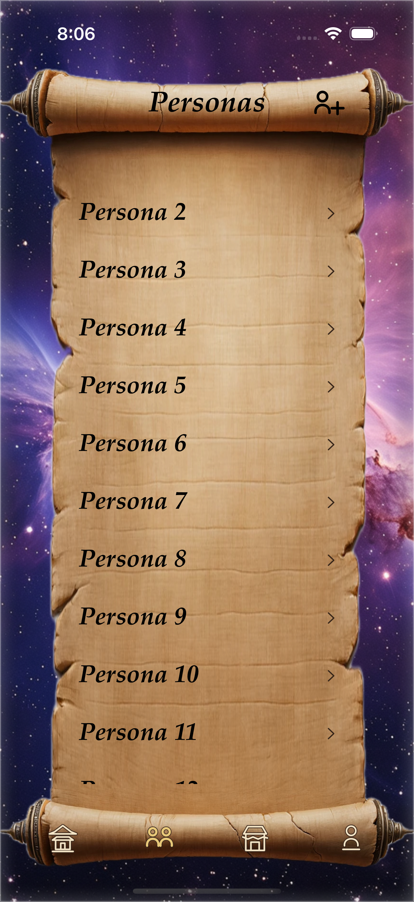
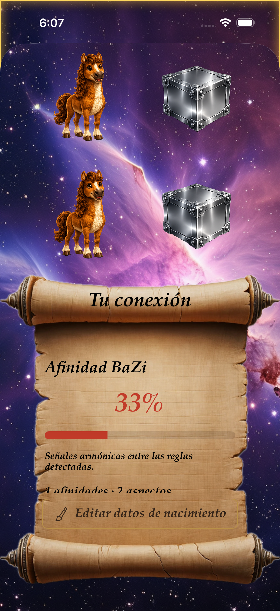

<div align="center">

# AstroZen 🐉

### Chinese astrology, personal discovery & meaningful connections

**A native iOS app with an offline BaZi engine, visual compatibility reports and a StoreKit 2 Premium experience.**


[App Preview](#-app-preview) · [Features](#-main-features) · [Tech Stack](#-tech-stack) · [Architecture](#-architecture) · [Contact](#-contact)

</div>

---

## ✨ The Project

**AstroZen** brings Chinese zodiac profiles, the five elements and BaZi birth charts into an illustrated iOS experience. Users can explore their own profile, save people they care about and compare their charts through visual summaries and expandable explanations.

The app combines a custom parchment interface with native navigation, local persistence, historical time-zone handling, subscriptions and a separately managed product catalog. Its four main destinations are **Home, People, Shop and Profile**.

Core profiles, calendar calculations and readings work offline. Birth information stays on the device; the commercial backend manages products and images.

> Astrology content is presented as symbolic interpretation. Compatibility percentages describe the rules found in the charts, not the probability of a successful relationship.

## 📱 App Preview

| Home | Shop | Personal BaZi profile  |
|:--:|:--:|:--:|
|  |  |  |

| Illustrated introduction | Personas Profiles | Compatibility |
|:--:|:--:|:--:|
|  |  |  |

*Actual simulator captures from documented validation runs. The shop shows its empty catalog state; the purchase screen uses StoreKit Testing.*

---

## 🌟 Main Features

### Personal profiles & daily exploration

- Create and edit a personal profile and saved people, including optional nicknames.
- Calculate the traditional Chinese zodiac animal and annual element using Chinese New Year boundaries.
- Explore solar year, solar month and BaZi day readings on Home.
- Refresh time-sensitive content when periods change or the app returns to the foreground.
- Browse an eight-page introduction with illustrations and a locally bundled video about the Great Race legend.
- Switch between **Spanish and English** inside the app.

### Premium BaZi reports

- Add birth time, city and historical time zone for yourself and saved people.
- Calculate the **four pillars**, Day Master, Yin/Yang, hidden stems and Ten-God relationships.
- Explore five-element composition through colored percentage bars and existing element illustrations.
- Read personal strengths, tendencies and practical suggestions with expandable details.
- Discover symbolic colors and He Tu numbers associated with the Day Master's element.
- Receive explicit partial reports when birth information is missing or ambiguous.

### Relationship compatibility

- Compare two birth charts with a visual affinity summary.
- See each person's animal and element in two distinct illustration rows.
- Compare elemental composition and explore affinities, tensions and shared practices.
- Open either person's full report directly from the comparison.
- Inspect the interpretation rules and pillar evidence behind the reading.
- Keep basic zodiac compatibility separate from the advanced BaZi analysis.

### Personalized shop

- Suggest products using locally calculated profile associations.
- Let Premium users choose themselves or a saved person as the recipient.
- Download a versioned catalog with manual refresh and a last-valid offline cache.
- Open validated Mercado Libre Argentina affiliate links externally.
- Manage bilingual products, authorized photos, drafts and publication history through a separate web panel.

*The catalog integration is implemented. Commercial activation awaits approved products, affiliate links and remaining administrator setup.*

---

## 🛠 Tech Stack

### Native iOS application

| Technology | Role in AstroZen |
| --- | --- |
| **Swift 5** | Application language; project configured with Swift 5 language mode. |
| **UIKit, Storyboards & Auto Layout** | Screen compositions, native controls, navigation and adaptive parchment layouts. |
| **MVC** | Controllers coordinate screens; models and services own domain calculations and persistence. |
| **Core Data** | Local profiles, isolated saves and lightweight model migration. |
| **StoreKit 2** | Products, purchases, restoration, verified entitlements and subscription updates. |
| **Combine** | Observing subscription changes and refreshing dependent screens. |
| **Swift Concurrency** | Async/await, cancellable tasks, main-thread UI coordination and an actor-backed catalog service. |
| **Foundation, Calendar & TimeZone** | Civil dates, historical time-zone resolution and temporal boundaries. |
| **Core Location / CLGeocoder** | Birth-city lookup and time-zone resolution, with manual alternatives; no GPS requirement. |
| **URLSession & Codable** | Catalog networking, typed JSON resources, decoding and validation. |
| **AVKit / AVFoundation** | Local legend video playback and media validation. |
| **UserDefaults & NotificationCenter** | Language/onboarding preferences and lifecycle-driven updates. |
| **Xcode & Swift Package Manager** | Builds, simulator workflows and package resolution. |

**SDK dependencies:** Google Mobile Ads **11.13.0** is initialized by the app. Google User Messaging Platform **2.7.0** is also resolved through SPM; this dependency alone does not imply a completed consent flow.

### Commercial backend & companion admin panel

| Technology | Role |
| --- | --- |
| **Supabase PostgreSQL & SQL migrations** | Product drafts, versioned releases and administrator membership. |
| **Supabase Auth, Storage & RLS** | Administrator authentication, product images and database access policies. |
| **Supabase Edge Functions, TypeScript & Deno** | Public `shop-catalog` endpoint serving the active release. |
| **React 19 & TypeScript** | Separate catalog administration interface. |
| **Tailwind CSS 4, shadcn/ui & Lucide** | Web panel styling, components and icons. |
| **Supabase JS** | Admin authentication, uploads and catalog operations. |
| **Vinext, Vite & Sites** | Web build tooling and private panel hosting; Cloudflare tooling supports its runtime. |
| **Node.js, npm, Oxlint & Oxfmt** | Panel tooling, dependency management, linting and formatting. |

The panel has an independent deployment repository. Its dependencies are separate from the iOS build; the iPhone app accesses the public catalog through `URLSession`, without a Supabase SDK or user account.

### Data generation & quality tooling

| Technology | Role |
| --- | --- |
| **Python 3** | Reproducible calendar generation and resource validation. |
| **Astronomy Engine 2.1.19** | Precomputed solar-term instants. |
| **lunar_python 1.4.8** | Lunar-year boundaries and independent BaZi reference fixtures. |
| **Ruby / xcodeproj 1.27** | Explicit registration of sources and resources in the Xcode project. |
| **XCTest, XCUITest & StoreKitTest** | Unit tests, interface flows, performance checks and simulated purchases. |
| **SQL & Node.js tests** | Catalog permissions and admin validation rules. |

Python astronomy libraries are development tools. The app reads bundled tables and does not run Python on iOS.

---

## 🧩 Architecture

AstroZen uses **UIKit/Storyboard MVC**, with domain logic kept outside view controllers.

| Layer | Responsibility | Examples |
| --- | --- | --- |
| **Models** | Immutable birth details, charts and report snapshots. | `BirthDetails`, `BaziChart`, `PersonalProfileReport`, `CompatibilityReport` |
| **Views & Storyboards** | Parchment compositions, reusable controls and visual report blocks. | `Main.storyboard`, `LegacyScreens.storyboard`, `AstroZenTheme`, `ReportVisuals` |
| **Controllers** | User actions, screen lifecycle, navigation and rendering. | `UserViewController`, `CompatibilityViewController`, `ShopViewController` |
| **Domain services** | Calendar boundaries, chart calculation and interpretation. | `ChineseCalendarService`, `BaziEngine`, `PersonalReportService` |
| **Persistence & integrations** | Validated saves, subscription access and catalog delivery. | `ProfileRepository`, `CoreDataManager`, `SubscriptionManager`, `ShopCatalogService` |

**Data flow:** edit a temporary profile draft → validate and persist → calculate an immutable report off the main thread → render it inside the storyboard's writing area.

Core Data objects stay within their managed contexts. Calculations receive value snapshots, and the subscription state is checked before advanced operations and presentation.

### Project structure

```text
AstroZen/
├── Main/                      # Home, People and Profile controllers
├── Controllers/               # Compatibility presentation
├── Models/                    # Profile snapshots and zodiac catalogs
├── Astrology/                 # Calendar, BaZi, reports and feature controllers
├── Services/                  # Persistence, subscriptions and Premium state
├── Views/                     # UIKit paywall and shared presentation
├── Walkthrough/               # Introductory navigation
├── Configuration/             # Runtime configuration and StoreKit catalog
├── Resourses/                 # Bundled engines, JSON data and video
├── AstroZen.xcdatamodeld/      # Versioned Core Data models
├── Main.storyboard            # Navigation and segue contracts
└── LegacyScreens.storyboard   # Shared visual compositions

AstroZenTests/                  # Unit, integration and performance tests
AstroZenUITests/                # UI and purchase flows
Scripts/                       # Data generation and validation
supabase/                      # Migrations, endpoint and permission tests
Documentation/                 # Architecture, screenshots and validation
```

---

## ⚙️ Engineering Highlights

### Calendar accuracy & incomplete information

Traditional zodiac years use **Chinese New Year**, while BaZi years use **Li Chun** and months use solar-term boundaries. The engine supports birth dates from **1901 to today** and Home content from **1901 through 2100**.

Birth times use the saved IANA time zone and historical rules. The selected convention changes the astrological day at **23:00 local civil time**. Nonexistent times are rejected; repeated times and uncertain transitions retain alternatives. Unknown birth times are evaluated without assigning a fabricated default.

Calendar generation is reproducible, and selected solar-term times are checked against independent Hong Kong Observatory fixtures. The implemented scope excludes true solar-time correction and Da Yun cycles.

### Explainable visual reports

Calculations, interpretation rules and localized text are separate. Conclusions retain rule identifiers and supporting pillars. Element bars use a documented equal-count convention, while the affinity indicator reflects harmonic versus tension rules. Full explanations remain available behind concise summaries.

### Safe local persistence

Edits use temporary drafts and isolated Core Data saves. Validation happens before persistence; cancelling does not change the original profile. Lightweight migration preserves existing records, and unreadable legacy dates are marked for correction instead of silently discarded.

### Responsive UIKit presentation

The design combines transparent lists, a custom transparent tab bar, handwritten-style typography and reusable parchment surfaces. It supports portrait layouts, VoiceOver labels, scalable body text and single-line zodiac titles with smaller Chinese characters.

The engine uses indexed solar-term lookup, bounded caches and shared equivalent requests. Abandoned work is cancelled, decoded resources are reused, and Home schedules a single timer for its next transition. Performance measurements and their simulator limits are recorded in the documentation.

### Local profiles, separate commerce

The catalog request does not include names, birth dates or chart data. Recommendations are calculated on-device. The backend applies administrator permissions to drafts and publication, while the public endpoint returns only the active catalog. City search, StoreKit and advertising are separate network integrations.

---

## 💎 Freemium Experience

| Free | Premium |
| --- | --- |
| Personal profile and saved people | Birth time and location editing |
| Traditional animal and element descriptions | Personal four-pillar BaZi reports |
| Basic zodiac compatibility | Advanced two-chart comparison |
| Home year, month and day readings | Visual element composition and symbolic associations |
| Illustrated introduction and legend video | Personalized interpretations with supporting details |
| Basic shop suggestions for your profile | Shop recipient selection from saved people |

StoreKit 2 handles product loading, verified purchases, restoration, pending purchases, cancellations and errors. Transaction updates refresh access in open screens. Expiration or revocation locks advanced sections while preserving birth data.

After unlocking Premium, a contextual prompt helps users complete missing time and location information. It can be dismissed, with a smaller completion action remaining inside the report.

## 🌍 Internationalization

**Spanish and English** are available through an in-app language selector. UI strings, reports, onboarding, purchase states and catalog content use stable localized keys. Changing language updates presentation without changing stored birth data or chart calculations.

---

## 🧪 Testing & Validation

The repository includes automated coverage for:

- Solar boundaries, lunar-year transitions, historical time zones and independent BaZi fixtures.
- Missing birth data, ambiguous hours, visual percentages and evidence-backed interpretations.
- Profile validation, isolated saves, cancellation and legacy data migration.
- StoreKit purchase, restoration, pending, expiration and revocation behavior.
- Navigation, walkthrough, video, language changes and larger text sizes.
- Catalog decoding, offline cache, affiliate URL validation and administrator permissions.

**Recorded validation — September 12, 2026:** the unit run passed 51 tests; the final iPhone 17 focused run passed 17 tests, and the iPhone SE run passed 3 UI flows. Debug builds, unsigned Release and static analysis passed. These runs overlap and are not a combined unique-test count.

[Visual report validation](Documentation/VisualBazi/README.md) · [MVC refactor and measurements](Documentation/MVCRefactor/README.md) · [Backend and shop validation](Documentation/PremiumShop/VALIDATION.md)

StoreKit Testing does not make real charges or replace App Store Sandbox validation. Simulator checks are reported separately from physical-device testing.

## 🚀 Run Locally

1. Open **`AstroZen.xcodeproj`** in Xcode 26.2, the version used for the recorded validation.
2. Allow Swift Package Manager to resolve dependencies.
3. Select the **AstroZen** scheme and an installed iOS simulator.
4. Build and run. For a physical iPhone, configure your own signing team.

```bash
# Debug build
xcodebuild -project AstroZen.xcodeproj -scheme AstroZen \
  -configuration Debug -destination 'generic/platform=iOS Simulator' build

# Tests — replace the destination with an installed simulator if needed
xcodebuild -project AstroZen.xcodeproj -scheme AstroZen \
  -destination 'platform=iOS Simulator,name=iPhone 17,OS=26.2' \
  -parallel-testing-enabled NO test

# Validate bundled data, localization and resource references
python3 Scripts/validate_resources.py
```

To exercise subscriptions, select **AstroZen Premium** and confirm **Run → Options → StoreKit Configuration → AstroZen.storekit**. Purchase and restore use verified simulated transactions, not a forced Premium flag.

[Full development guide: calendar regeneration, migration, builds and device setup](Documentation/Development/README.md)

## 📌 Project Status

The native app, local calculation engine, Premium flows and visual reports are implemented. The shop client, catalog backend and companion admin panel are also implemented; publishing the first commercial catalog requires real products, approved affiliate links and completion of administrator configuration.

App Store publication and commercial affiliate attribution are not claimed here. Release preparation includes physical-device acceptance and App Store Sandbox verification.

## 🎯 Skills Demonstrated

- Building a cohesive native iOS product with UIKit, Storyboards and MVC.
- Translating a complex calendar domain into deterministic, testable Swift models.
- Preserving user data across validation, editing and Core Data migration.
- Implementing subscriptions that handle the full entitlement lifecycle.
- Designing accessible visual summaries with traceable, expandable explanations.
- Integrating a commercial backend without uploading personal chart data.
- Maintaining reproducible resources, regression tests and documented validation.

## 📚 Further Reading

- [UIKit and Storyboard design](Documentation/LegacyDesign/README.md)
- [Visual BaZi conventions and screenshots](Documentation/VisualBazi/README.md)
- [Walkthrough, illustrations and video](Docs/Walkthrough/README.md)
- [Premium profiles and catalog architecture](Documentation/PremiumShop/IMPLEMENTATION.md)
- [MVC simplification and performance](Documentation/MVCRefactor/README.md)
- [Development guide](Documentation/Development/README.md)

---

## 📬 Contact

**German Bonnettini · Mate Code Studio**

Interested in the project, its implementation or an iOS development opportunity?

- **Email:** [germanbonnettini@yahoo.com.ar](mailto:germanbonnettini@yahoo.com.ar)
- **LinkedIn:** [German Bonnettini](https://www.linkedin.com/in/german-bonnettini/?locale=en-US)
